# Day 5, Session 2 - Segmenting Data with Cellpose

*Lab authors: Beth Cimini*

---

## Learning Objectives

- Try Cellpose models on a variety of data
- Learn to tell if Cellpose needs to be re-trained or just the parameters played with
- Compare performance in Cellpose 4 to performance in Cellpose 3

You can download some sample images from [this Drive folder](https://drive.google.com/drive/folders/1NOt_OeMVr6Y5ZK5CrYtG97-P05yABHlx?usp=sharing) (it's the same data we used yesterday in MicroSAM, if you already downloaded that, plus some of the images we used the first day on Piximi, if you still have those)

---

It's finally here, the last software we're going to teach you - Cellpose!

## Installation

Using Pixi:
Clone the **BAB3** repo locally (during the course, you should have already done this part!) and `cd` into that directory, then:

```bash
cd pixi_envs/cellpose3 #go to the directory containing the pixi files
pixi shell --frozen #activate the new cellpose3 environment (and install, if not already installed)
```

If successful, you should see `(cellpose3)` before your command line prompt. Within this Pixi shell, you should have everything you need for this workshop. You can activate Cellpose just by running `cellpose`

You can always exit the Pixi environment using the `exit` command.

If you get this error when activating Cellpose: `OMP: Error #15: Initializing libomp.dylib, but found libomp.dylib already initialized.` then run:

```bash
pip install --force-reinstall "cellpose<4" 
```

When you're ready for Cellpose4, the procedure is the same:

```bash
cd pixi_envs/cellpose4 #go to the directory containing the pixi files
pixi shell --frozen #activate the new cellpose4 environment (and install, if not already installed)
`cellpose`
```

## Exercise part 1 - Cellpose 3

```{margin} Want to learn more about working with Cellpose?
Check out the [documentation](https://cellpose.readthedocs.io/en/latest/), or check them out on [the image.sc forum!](https://forum.image.sc/tag/Cellpose)
```

Today, we have access to 3 of the MicroSAM example datasets (a timelapse set, a pathology set, and a 3D set, as well as the microglia images from Monday's exercise). Let's see how well they perform!

Cellpose 3 can be pretty great out of the box - here it is, untrained, on one of the pathology images.

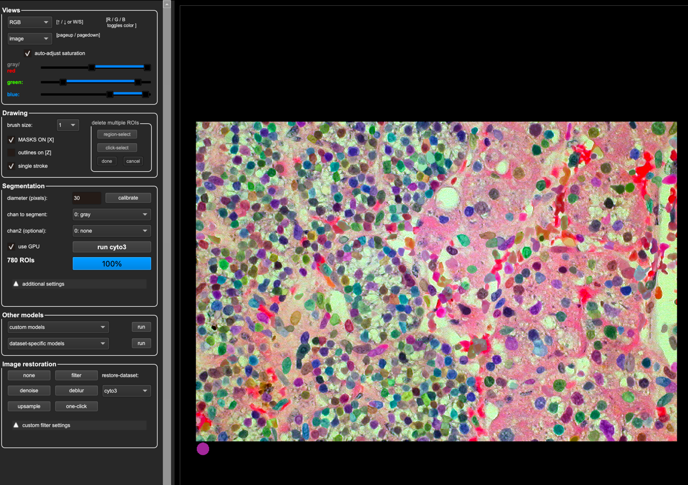

### Initially explore performance with an image set

So let's go to one that's a little less good and see how it does.

- Load an image from the timelapse set and let the `cyto3` default model run. Good, but not great!

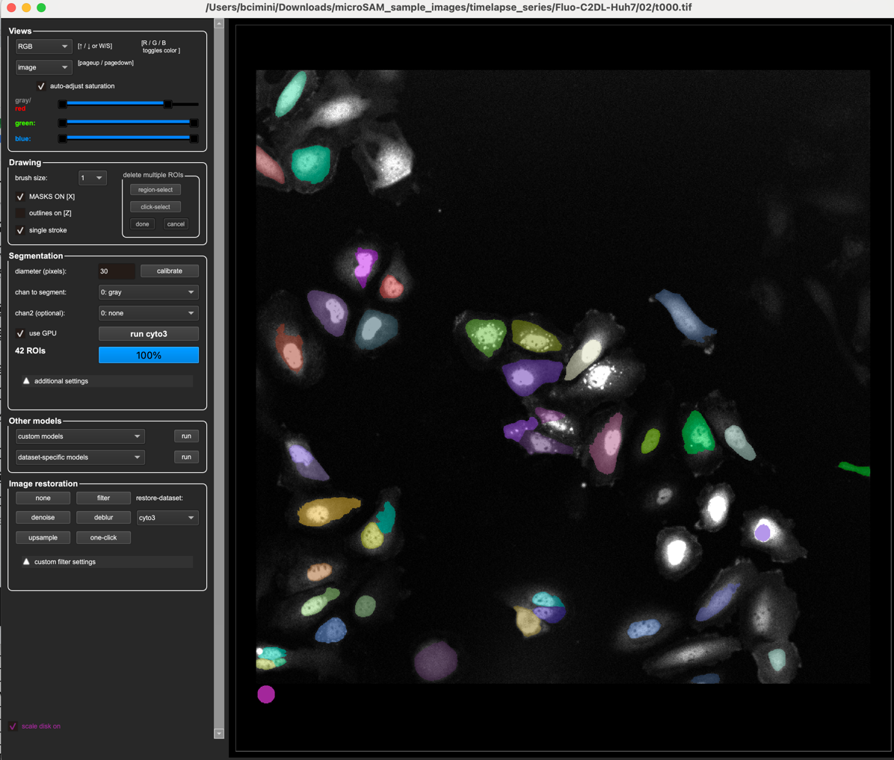

- One parameter Cellpose (in 1-3, anyway) is pretty sensitive to is the initial diameter prediction - what happens when we change that?

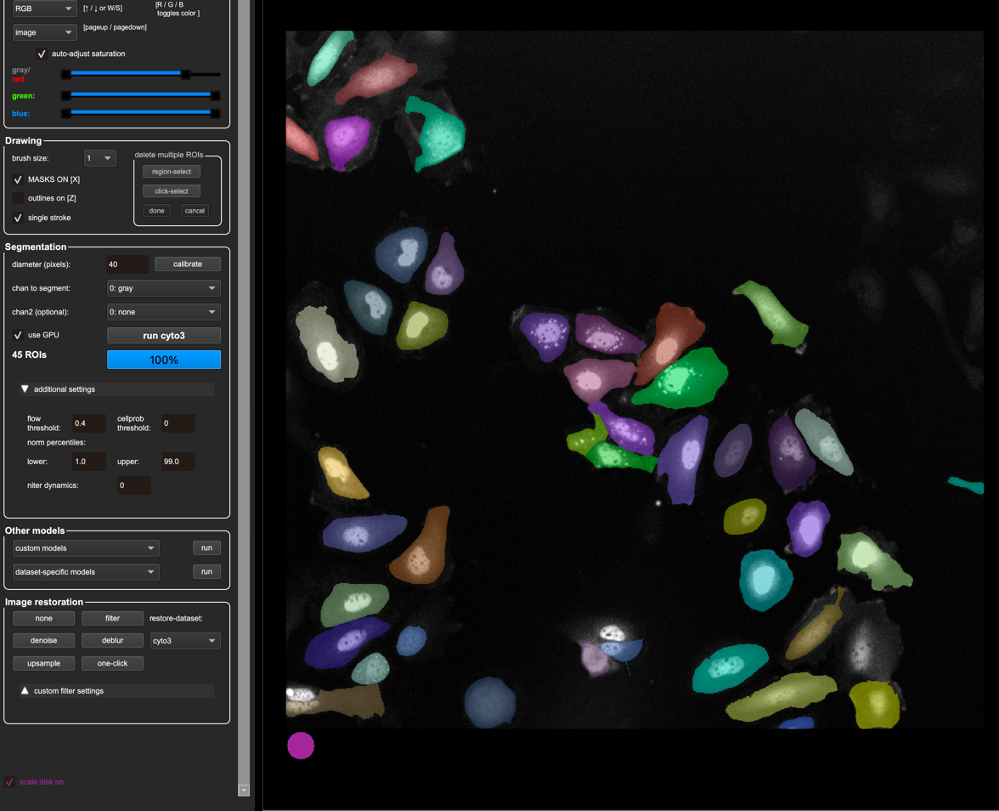

- Check the "dataset-specific models" on the left bar - do any of them do better than cyto3?

### Fixing parameters rather than retraining

If we can avoid retraining, it is always nice to avoid it where we can. Thankfully, there are a couple more very powerful parameters we can tune in Cellpose - how "coherent" of a flow it needs to have in order to consider an object a cell or not, as well as the probability threshold of if it's a cell or not. Cellpose makes images of the flow and the probability and we can access these images in the top left under the "Views" menu, by changing from "Image" to "gradxy" or "cellprob".

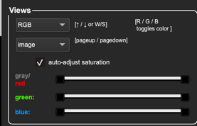

See what they look like below!

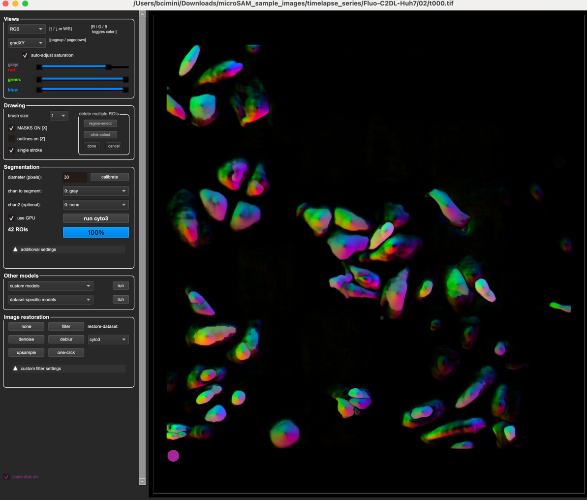
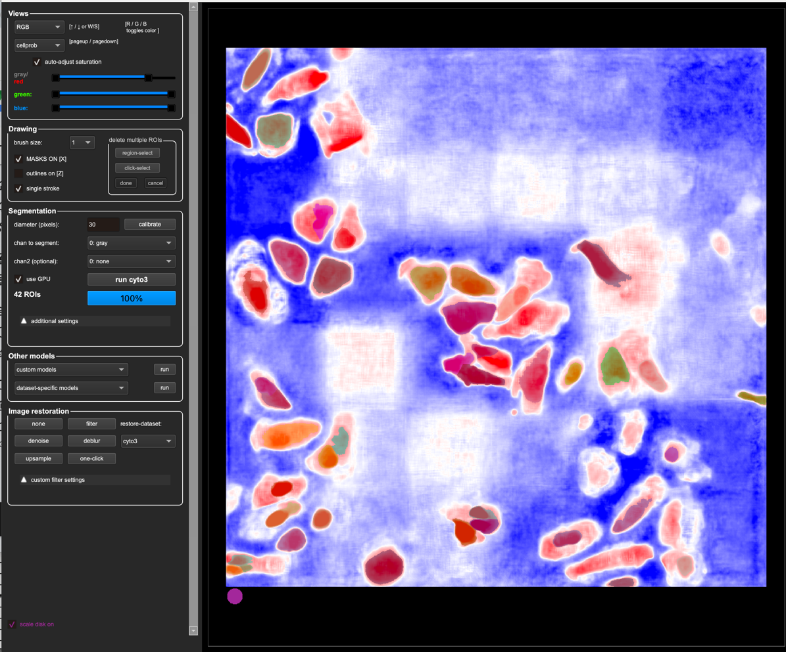

In the "Additional Settings" menu, Cellpose lets us adjust these parameters

```{margin}
Using Cellpose models in CellProfiler? We let you adjust them too!
```

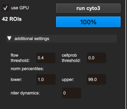

- Play around with the flow threshold and cellprob threshold - can you improve the segmentation without retraining?

```{tip}
Not sure how to tune these parameters or what they mean? Hover over them to learn more!
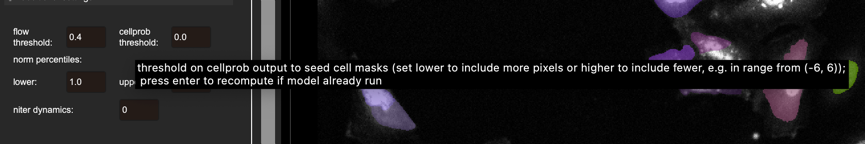 
```

### Retraining

Human-in-the-loop retraining (and easy finetuning) is why we love Cellpose so much, so let's give it a try!

- Take a good automatic prediction, and delete the masks you don't want anymore
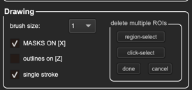

```{tip}
Not sure how to annotate? Try the help menu for tips and hotkeys!
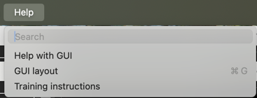
```

- Annotate any cells you need to, by right clicking (or ctl+click to start, then release ctl and just keep drawing until the circle closes).
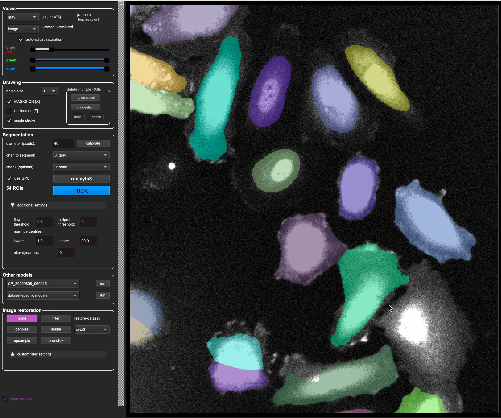

- After you finish on image, go to `Models -> Train` to train a new model. Cellpose will automatically run it for you once it's done training.
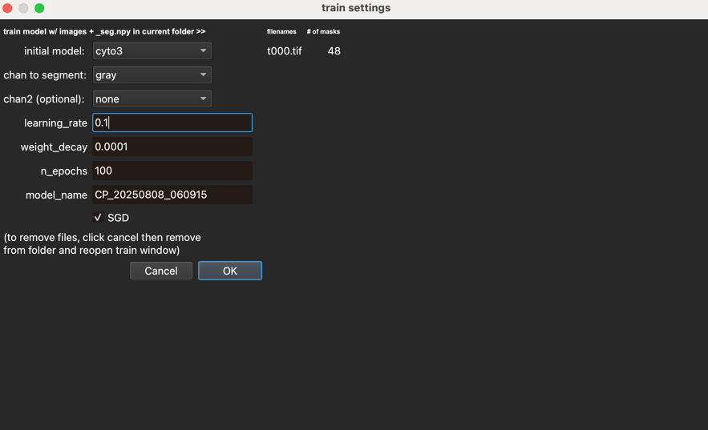

- How did it do?

- Go to the next image, and try either a built-in model or your one-image model, and then fix up the annotations for training. Train with two images. How well does it work now?

- How about with 3?

## Exercise 2

- Play around a bit with the microglia data, as above.
- How good can you make it look without retraining?
- How easily can you retrain it?

## Exercise 3

- Bring the worst peforming dataset (it will probably be the microglia) over to Cellpose 4. How well does it do out of the box?

(Unfortunately, it looks like there is a bug in Cellpose 4.0.6, the version that we have in the pixi Cellpose 4 pixi environment, that affects retraining, so it may not work for you to retrain Cellpose 4 in the same way that you could in the previous exercise with Cellpose 3.)

To exit Cellpose 3 and enter Cellpose 4, you will need to exit the Pixi shell and re-enter the other environment.

```bash
exit # exit Cellpose 3 pixi shell
cd ../cellpose4 # go to the directory containing the Cellpose 4 pixi files
pixi shell --frozen # activate the new Cellpose 4 environment (and install, if not already installed)
cellpose # start Cellpose 4
```

As we've mentioned, Cellpose 4 uses a different architecture (SAM-based) and as a consequence is much more compute intensive. If you have a GPU available, you will absolutely want to use it. Cellpose 4 will run on CPU, but it will be (potentially prohibitively) slow.

<!--
## Bonus exercise

- How do Cellpose 3 (and Cellpose 4, if your computer can handle it) work on the 3D dataset?

(Note that you'll have to close the GUI and reopen it with `cellpose --Zstack`)

What if you try 2.5D mode (leave the stitch threshold parameter at 0) vs overlap mode (set the stitch threshold to something greater than 0)? Note that overlap is much faster, so you may want to try that first!
-->