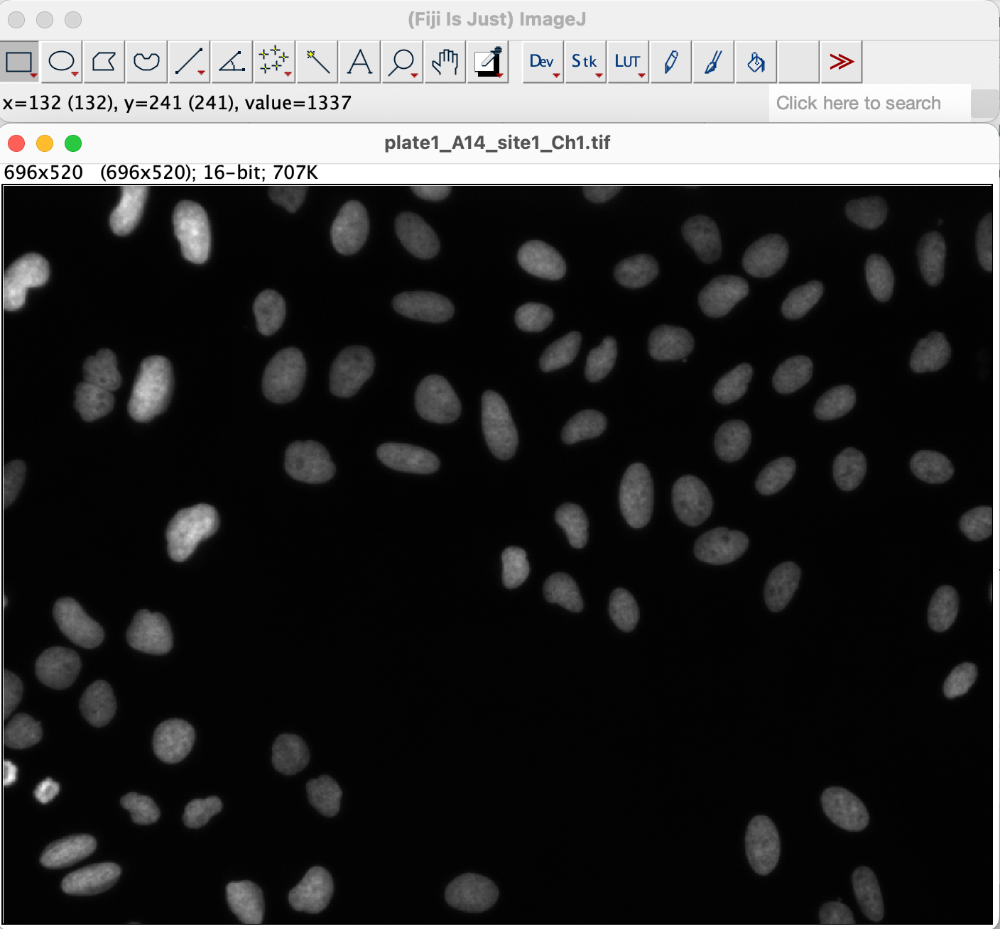
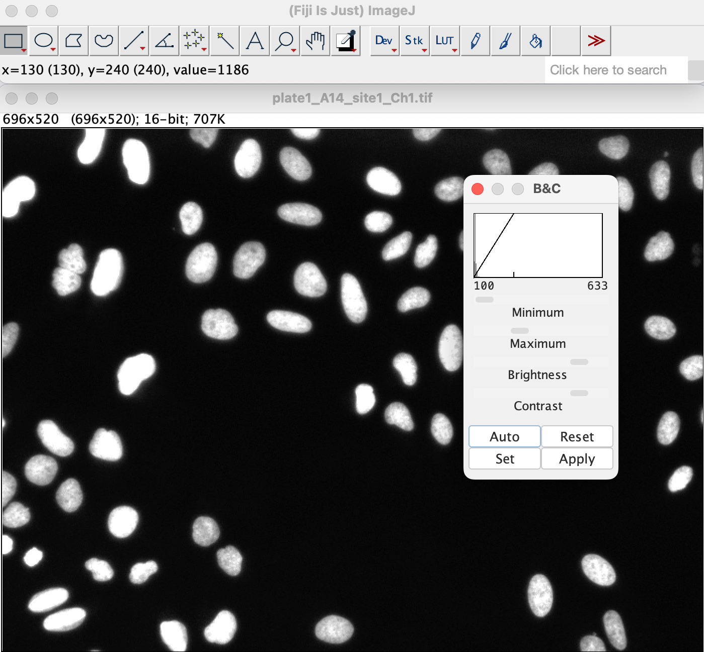
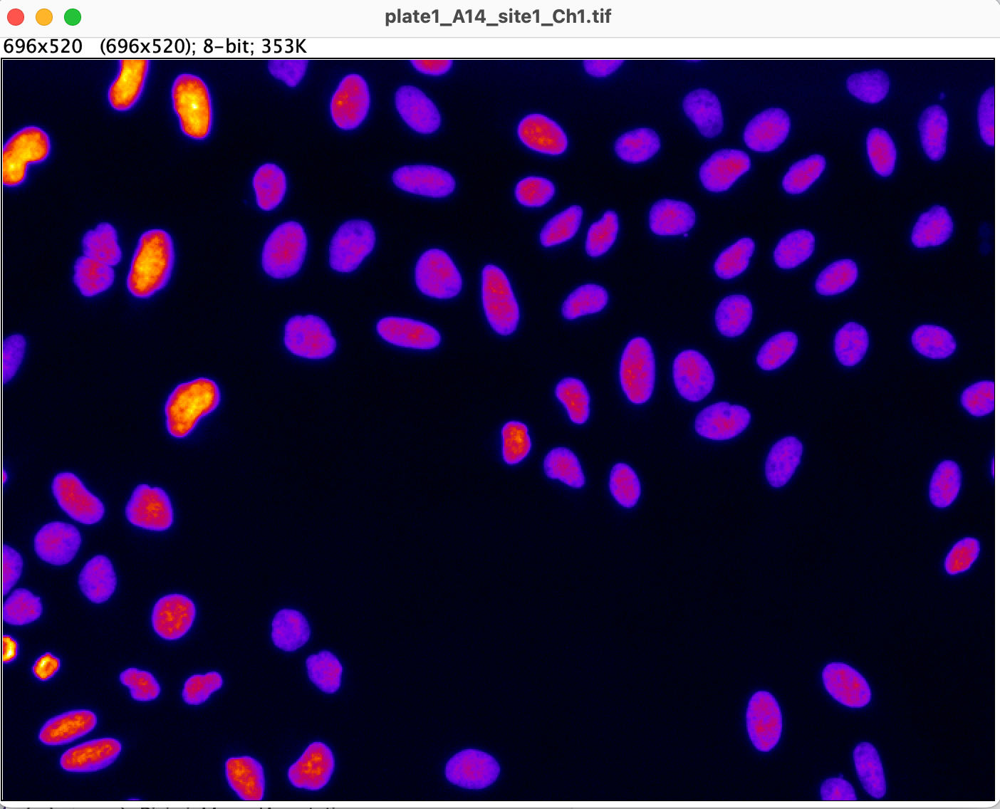

# Day 1: Introduction to FIJI

Lab authors: Erin Weisbart

## Learning Objectives

- Be introduced to FIJI
- Practice opening images in FIJI and exploring some of their properties
- Practice applying filters to an image in FIJI

## Preparation

Prior to this exercise, you should have [downloaded FIJI](https://fiji.sc) and the Beginner Segmentation image set.

## Warning

As we are using this same image set in future exercises, please do not save any changes to the original images.

## Open an image in FIJI

Open FIJI.

Open the first image in the `images_Illum-corrected` folder in FIJI. You can do this by going to `File > Open...` and navigating to the image location, or by dragging and dropping the image file into the FIJI window.

## Explore image properties

Hover your mouse over the image and notice the x, y coordinates and the pixel value being reported in the status bar at the bottom of the FIJI window.

Adjust the contrast of the image by going to `Image > Adjust > Brightness/Contrast...` (or pressing `Shift + C`). In the Brightness/Contrast window, click `Auto` to automatically adjust the contrast. You can also manually adjust the sliders to change the brightness and contrast of the image. Look at the pixel values in the status bar as you adjust the contrast.

Click `Apply` in the Brightness/Contrast window and look at the pixel values again. How have they changed?

Close the image (without saving changes) and open it again. Change the bit depth by going to `Image > Type > 8-bit`. Look at the pixel values in the status bar again. How have they changed?

## Explore Look Up Tables (LUTs)

Change the LUT of the image by going to `Image > Lookup Tables` and selecting a different LUT. Try a number of different LUTs.

- How does this change the appearance of the image?
- Does it change the pixel values reported in the status bar?
- Are there any LUTs that make it *easier* to see differences in nuclei intensities in the image?
- Are there any LUTs that make it *harder* to see differences in nuclei intensities in the image? (hint: try `Blue`)

## Explore filters

Return your image to the default LUT by going to `Image > Lookup Tables > Grays`.

Explore some of the filters available in FIJI by going to `Process > Filters` and selecting a filter to apply to the image. See how the filter changes the appearance of the image. See if it pixel affects intensities.

Hint: You can undo filter applications by going to `Edit > Undo` or pressing `Ctrl + Z` (or `Cmd + Z` on Mac).
