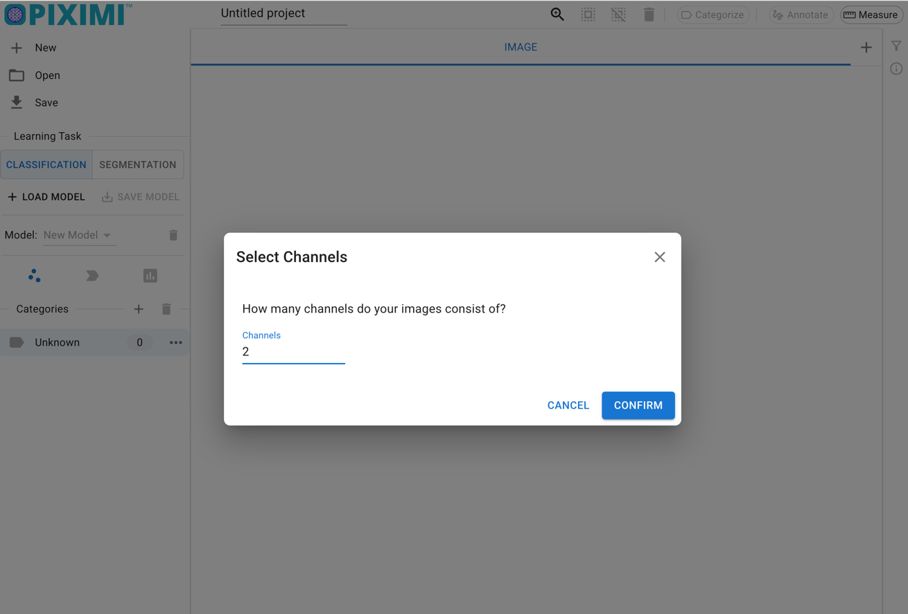

# Day 1, Exercise 5 - Making manual annotations with Piximi

*Lab authors: Beth Cimini, Kate Bowers* . 

---

## Learning Objectives
- Practice making manual annotations in multichannel images in Piximi
- Turn images into measurements and graphs

**Lab Data** in [this folder](https://drive.google.com/drive/folders/1TyV_hzN2pDpX0lVQ_jh08A9AG5e4Bao8?usp=drive_link)

---

While [Piximi](https://piximi.app/){cite}`Moser2024-vt` can do a lot of cool things, today we'll only be using two of its functionalities - manual annotation and measurement. 

We'll be using a dataset of microglia stained in rat brains - you can read more of the specifics in the [dataset readme](https://drive.google.com/file/d/1wdz7pikmfWAEXUeGQ3VcDn1rwnqKyYYm/view?usp=sharing).

## Exercise Part 1 - Manually annotate some nuclei

```{margin} Want to learn more about working with Piximi?
Check out the [documentation](https://documentation.piximi.app/intro.html) (which includes some full-length tutorials), or check them out on [the image.sc forum!](https://forum.image.sc/tag/piximi)
```

- Download the dataset linked above to your local machine. We'll be using it throughout the week, so don't delete it!
- Open Piximi.app, and click "Start New Project".
- Drag the images from the folder to Piximi, and tell Piximi that they have 2 channels.




- The images should now all be visible in Piximi's main experiment view - hit "Annotate" to bring them into the Annotator View (also called the Image View).


```{tip}
Running into trouble? Toggle on Piximi's help mode on the left bar, which will help you figure out how to use each feature!


```

- Hit the `+` button next to the word Kinds to make a new object kind - you'll probably want to call it Nuclei or something like that.


  - Optionally - if you'd like to separate your nuclei into categories (such as "microglial nuclei" or even just "big nuclei" vs "small nuclei"), you can do this in one of two ways: 
    - In the menu under Nuclei, you can make as many categories as you like, and if a category is selected while you are annotating, the object will be automatically assigned to that category.
    - Once you've made and saved your annotations, you can see the objects you've made back in the Experiment view - you can add (or change!) categories for as many objects as you would like. 
    

- Time to play! Piximi has several kinds of annotation, [which you can learn more about here](https://documentation.piximi.app/pages/detail/imageviewer.html#annotation-tools) and see in action [here](https://documentation.piximi.app/pages/detail/imageviewer-tools-annotation.html). 

- To annotate, select an annotation tool from the right sidebar. Try out a few different tools, and explore their options. For example: 
  - Use the rectangle, ellipse, or polygon tools to make an annotation of a particular shape.
  - Try using the pen tool to fill in a nucleus. You can change the size of the pen by selecting the tool and pressing the small arrow to the left of the icon to access the size slider.
  - With the Color/Fill tool, try clicking the center of a nucleus and dragging out to create an annotation over the object. 
  - Play around with the Quick Annotation tool, which tries to predict annotations near your cursor. You can adjust the sensitivity with a slider.
  - Select an area with the Threshold tool, then use the slider to adjust the threshold to detect the bounds of your object. (Any objects identified within this area will be recorded as one annotation.)


- You can also modify existing annotations with the augmentation tools Combine, Subtract, Intersection, and Invert.

- Which annotation tools work best for you? Are some better for certain "classes" of nuclei? 


```{tip}
Want to change the colors or adjust the brightness contrast? Piximi [can do that](https://documentation.piximi.app/pages/detail/imageviewer.html#image-tools)!
```
- When you are done annotating (and/or want to change some categories for some annotations), hit the back arrow to return to the main view.


- Make sure to save your project file for future use!

- In the main view, you can click to the 'Nuclei' section on the top bar and see all of the annotations you just made. How do they look? You can add or change categories for any objects.

-----

## Exercise Part 2 - Making some measurements

Rarely do we want stop at just finding objects and categorizing them - often, we want to know things about them.
With Piximi, we can take different measurements of these objects, plot the data in Piximi, and export measurements for further analysis. 

Currently, Piximi supports two broad classes of measurements - intensity measurements, which work for images OR objects, and shape/geometry measurements, which work for objects alone. More categories of measurements will be rolling out in time - stay tuned!

- Follow Piximi's [Measurements tutorial](https://documentation.piximi.app/pages/tutorial/creating-measurements.html) to learn how to create and export measurements for your identified nuclei.
  - If you've created categories (or want to do so now), you can see how your measurements differ by categories as well.
- Play around with plotting in Piximi. Use histograms to check area and intensity distributions. Try making a scatterplot comparing different measurements, colored by category. How do intensity and shape measurements vary together?
- Save your measurements as an Excel spreadsheet by selecting your desired measurement categories on the left side of the Measurements window and pressing `Export`. You can save any plot as a PNG by pressing `Save To PNG`
- How would you use these measurement and plotting tools on your data?

---


## **Bonus Exercise - Annotating some cells**

- Try to annotate some cells - in the annotator view, hit `+` to create a new "Kind" called cells


- Annotate some cells, trying a few different Piximi functionalities for annotation - do you find the same tools optimal for annotating cells and nuclei? Are some tools better suited for one or the other? You can use the Channel Adjustment tool on the top bar to toggle the nuclei and microglia channels on and off.

---
